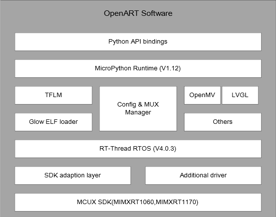

# OpenArT

[](https://github.com/RT-Thread/rt-thread/releases)
[](https://travis-ci.org/RT-Thread/rt-thread)
[](https://gitter.im/RT-Thread/rt-thread?utm_source=badge&utm_medium=badge&utm_campaign=pr-badge&utm_content=badge)
[](https://github.com/RT-Thread/rt-thread/pulls)
[](https://github.com/RT-Thread/rt-thread/pulls)

OpenART是一个基于NXP MCU的开源AI开发验证平台，支持最流行的引擎:TFlite-Micro, CMSIS-NN, Glow。

为AI开发者提供了一套快速简洁的模型验证方法：基于Micropython环境使用python API运行模型。并支持机器视觉库OpenMV，图形库LVGL。可以同时使用python开发AI应用界面程序。

## 简介

OpenART支持当前最流行RTOS:RT-Thread以及它的构建工具
RT-Thread包含了一个自有的、传统的硬实时内核：可抢占的多任务实时调度器，信号量，互斥量，邮箱，消息队列，信号等。当然，它和传统的实时操作系统还存在着三种不同：

* 设备驱动框架；
* 软件组件；
* 应用模块

设备驱动框架更类似一套驱动框架，涉及到UART，IIC，SPI，SDIO，USB从设备/主设备，EMAC，NAND闪存设备等。它会把这些设备驱动中的共性抽象/抽取出来，而驱动工程师只需要按照固定的模式实现少量的底层硬件操作及板级配置。通过这样的方式，让一个硬件外设更容易地对接到RT-Thread系统中，并获得RT-Thread平台上的完整软件栈功能。

软件组件是位于RT-Thread内核上的软件单元，例如命令行（finsh/msh shell），虚拟文件系统（FAT，YAFFS，UFFS，ROM/RAM文件系统等），TCP/IP网络协议栈（lwIP），Libc/POSIX标准层等。一般的，一个软件组件放置于一个目录下，例如RT-Thread/components目录下的文件夹，并且每个软件组件通过一个 SConscript文件来描述并被添加到RT-Thread的构建系统中。当系统配置中开启了这一软件组件时，这个组件将被编译并链接到最终的RT-Thread固件中。

注：随着RT-Thread 3.0中的包管理器开启，越来越多的软件组件将以package方式出现在RT-Thread平台中。而RT-Thread平台更多的是指：

* RT-Thread内核；
* shell命令行；
* 虚拟文件系统；
* TCP/IP网络协议栈；
* 设备驱动框架；
* Libc/POSIX标准层。

更多的IoT软件包则以package方式被添加到RT-Thread系统中。



## General Purpose

### AI Education

支持最流行的引擎:TFlite-Micro, CMSIS-NN, Glow以及常用模型： 
*Mobilenet V1
*Mobilenet V2
*Inception V3
*Cifar 10
*Lenet

### Machine Vision

OpenMV项目旨在通过开发一个用户友好的、开源的、低成本的机器视觉平台，使机器视觉更易于为初学者使用。
Version 3.6

### MCU Education

通过python脚本学习使用通用MCU外设控制等。
version: Micropython 1.12

## 支持的硬件

* ```MIMXRT1060-EVK```
* ```MIMXRT1170-EVK```
* ```SeekFree Openart-mini```

## 演示示例

- Cifar10 示例，在目录： 'examples\cifar10_lvgl'

- LVGL 控件示例，在目录： examples\lvgl_widgets

- 人脸识别示例，在目录：examples\mobilefacenet_lvgl

- 性别识别 示例，在目录： examples\gender_detection

## 许可证

RT-Thread从v3.1.1版本开始，是一个以Apache许可证2.0版本授权的开源软件，许可证信息以及版权信息一般的可以在代码首部看到：

    /*
     * Copyright (c) 2006-2018, RT-Thread Development Team
     *
     * SPDX-License-Identifier: Apache-2.0
     */

从2018/09/09开始，开发者提交PR需要签署贡献者许可协议（CLA）。

注意：

以Apache许可协议v2.0版本授权仅在RT-Thread v3.1.1正式版发布之后才正式实施，当前依然在准备阶段（准备所有原有开发者签署CLA协议）。

## 编译

RT-Thread使用了[scons](http://www.scons.org)做为自身的编译构建系统，并进行一定的定制以满足自身的需求（可以通过scons --help查看RT-Thread中额外添加的命令）。在编译RT-Thread前，请先安装Python 2.7.x及scons。

截至目前，RT-Thread scons构建系统可以使用命令行方式编译代码，或者使用scons来生成不同IDE的工程文件。在使用scons时，需要对构建配置文件（rtconfig.py）中如下的变量进行配置：

* ```CROSS_TOOL``` 指定希望使用的工具链，例如gcc/keil/iar. 
* ```EXEC_PATH``` 工具链的路径. 

注：在SConstruct文件中：

```RTT_ROOT``` 这个变量指向了RT-Thread的发布源代码根目录。如果你仅计划编译bsp目录下的target，这个`RTT_ROOT`可以使用默认配置。另外，你也可以设置同名的环境变量来指向不同的RT-Thread源代码根目录。

当你把相关的配置都配置正确后，你可以在具有目标目录下（这个目录应包括rtconfig.py、SContruct文件）执行以下命令：

    scons 

从而简单地就编译好RT-Thread。

如果你希望使用IDE来编译RT-Thread，你也可以使用命令行：

    scons --target=mdk/mdk4/mdk5/iar/cb -s 

来生成mdk/iar等的工程文件。而后在IDE中打开project前缀的工程文件来编译RT-Thread。

注意：RT-Thread的scons构建系统会根据配置头文件rtconfig.h来裁剪系统。例如，如果你关闭了rtconfig.h中的lwIP定义（通过注释掉```#define RT_USING_LWIP```的方式），则scons生成的IDE工程文件中将自动不包括lwIP相关的文件。而在RT-Thread 3.0版本中，可以通过menuconfig的方式来配置整个系统，而不需要再手工更改rtconfig.h配置头文件。

### 示例代码:

```
import sensor,image,tf

sensor.reset()
sensor.set_pixformat(sensor.RGB565)
sensor.set_framesize(sensor.QVGA)
net = "xxx.tflite"
while(1):
    img = sensor.snapshot()
    objs = tf.classify(net,image) #classify the type of image
    objs = tf.detect(net,image) #find object in image
```
