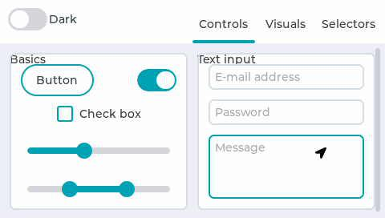

# Example : LVGL Widgets  #

## Overview ##

This example is showing the widgets of LVGL running on OpenART.

## Requirements ##

### Hardware ###

#### MIMXRT1060EVK ####

LCD: RK043FN02H-CT

SD Card

#### MIMXRT1170EVK ####

LCD: RK055HDMIPI4M

SD Card

### Software ###

IDE: MDK V5.33

#### Project Config ####

Open env tools in 'bsp\imxrt\imxrt1062-nxp-evk' or 'bsp\imxrt\imxrt1176-nxp-evk'

Use command 'menuconfig' to configurate the project

Make sure "MicroPython" in 'NXP Software Components' is enabled shown as :

 

And the in 'Hardware Drivers' the configuration is shown as :

**Please notice that 'GPT1' must be selected, LGVL is depending on it.**

After save the configuration, use command 'scons --target=mdk5 -s' to generate the project.

Open the project in MDK and compile it.

## Run the example ##

- 1 Download the program to the evk board

  2 Connect the debug COM with PC
  
  3 Plugin the SD Card after copy lvgl_widgets.py
  
  4 Reset the borad, board enter msh mode
  
  5 Excute the scripyt by command: 'python lvgl_widgets.py'
  
  

