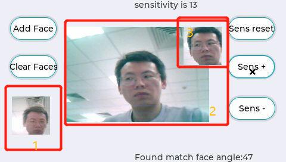

# Example : Mobile Face Net with LVGL  #

## Overview ##

This example is showing the mobile face net TF-lite Micro model running on OpenART.

In this example , the model calculate angle of the face image and compare with local saved faces to find out the same person.

example running like this.

1 showing the result : the same person saved in local disk
2 showing the current picture comes from camera
3 showing the faces found from the picture

## Requirements ##

### Hardware ###

#### MIMXRT1060EVK ####

SD Card

LCD: RK043FN02H-CT

Camera: OV7725 

#### MIMXRT1170EVK ####

SD Card

LCD: RK055HDMIPI4M

Camera: MT9M114 

### Software ###

Model Files: "mfn_drop_320_best_quant.tflite", need store in SD Card

IDE: MDK V5.33

#### Project Config ####

Open env tools in 'bsp\imxrt\imxrt1062-nxp-evk' or 'bsp\imxrt\imxrt1176-nxp-evk'

Use command 'menuconfig' to configurate the project

Make sure "MicroPython, OpenMV" in 'NXP Software Components' is enabled shown as :

 
 

And the in 'Hardware Drivers' the configuration is shown as :

**Please notice that 'GPT1' must be selected, LGVL is depending on it.**

After save the configuration, use command 'scons --target=mdk5 -s' to generate the project.

Open the project in MDK and compile it.

## Run the example ##

- 1 Download the program to the evk board

  2 Connect the debug COM with PC
  
  3 Plugin the SD Card, copy the model file , MobileFaceNet_lvgl.py 
  
  ​    4 Rename  gender_detect.py to main.py, copy to SD Card.
  
  ​    5 Reset the board, omv thread will run into main.py
  
  ​    OR
  
  ​	4 Reset the borad, board run into omv thread and connect with OpenMV IDE through usb cable.
  
  ​	5 Execute the gender_detect.py in openMV IDE, disable Frame Buffer on the right top
  
- 6 Add face by press button "Add Face". showing yourself in front of the camera. If your face is found ,there will be a message box to ask you to add the face, press yes. 

- 7 After added the face, you can test your model now. 

